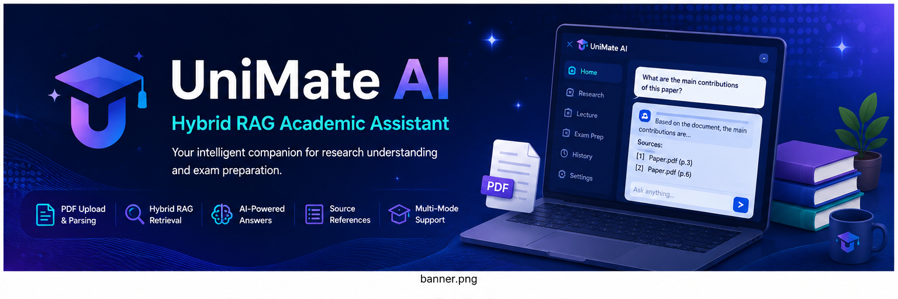
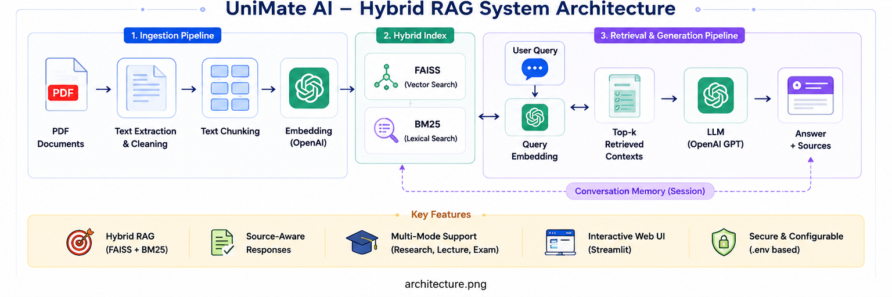
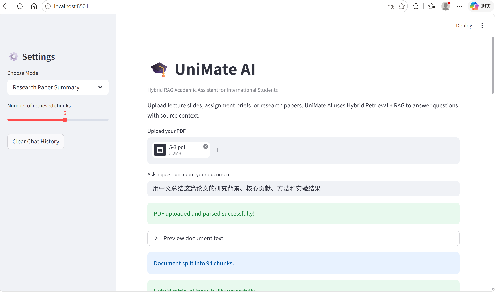
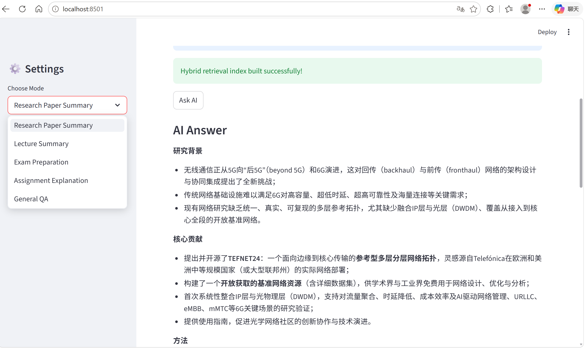
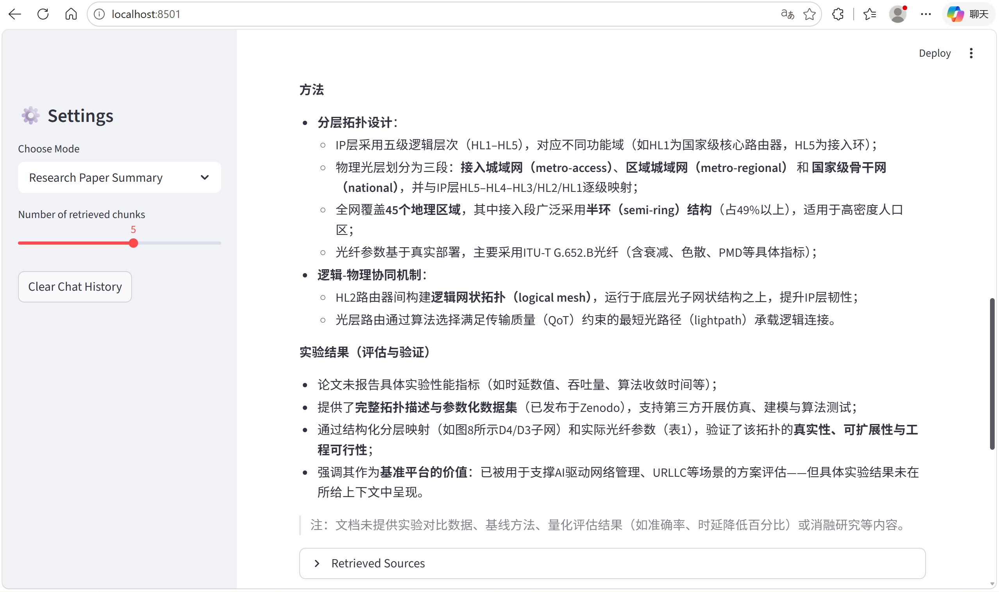
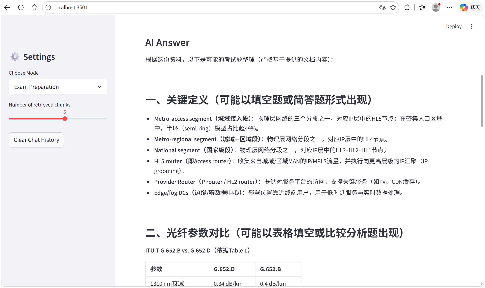
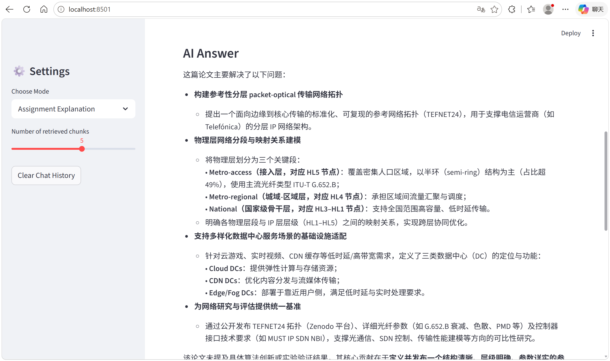
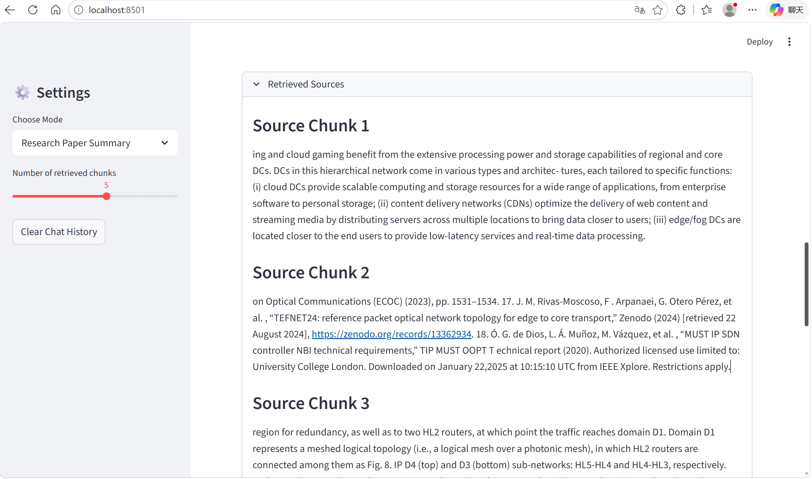
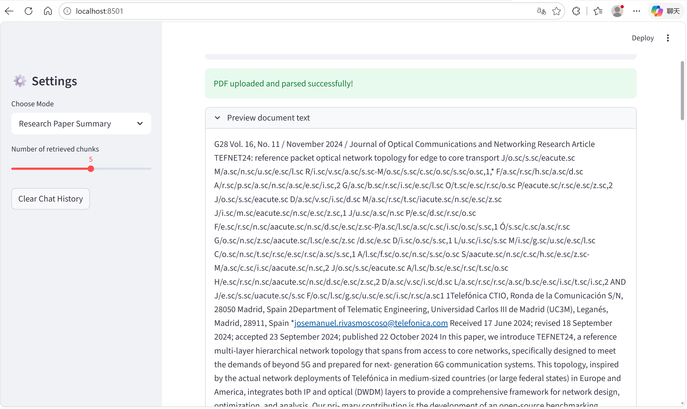

# UniMate AI

Hybrid RAG Academic Assistant for International Students

## Features

- PDF Upload and Parsing
- Hybrid RAG Retrieval
- FAISS Semantic Search
- BM25 Keyword Search
- Research Paper Summary
- Lecture Summary
- Exam Preparation
- Assignment Explanation
- General Question Answering
- Retrieved Source Display

## System Architecture



## Screenshots

### Home Interface



### Multiple AI Modes



### Research Paper Summary



### Exam Preparation Mode



### Assignment Explanation



### Retrieved Sources



### PDF Preview



## Installation

### 1. Create Virtual Environment

```bash
python -m venv .venv
```

### 2. Activate Environment

Windows:

```bash
.venv\Scripts\activate
```

Mac/Linux:

```bash
source .venv/bin/activate
```

### 3. Install Dependencies

```bash
pip install -r requirements.txt
```

### 4. Run Project

```bash
streamlit run app.py
```

## Tech Stack

| Technology | Usage |
|---|---|
| Python | Backend |
| Streamlit | UI Framework |
| OpenAI API | LLM |
| PyPDF | PDF Parsing |
| LangChain | Text Splitting |
| FAISS | Vector Search |
| BM25 | Keyword Retrieval |

## Project Structure

```text
API大模型RAG与智能体开发/
│
├── app.py
├── requirements.txt
├── README.md
│
├── assets/
│   ├── banner.png
│   ├── architecture.png
│   ├── home.png
│   ├── modes.png
│   ├── research_summary.png
│   ├── retrieval.png
│   ├── exam_mode.png
│   ├── assignment_mode.png
│   └── preview_document.png
```

## Project Highlights

- Hybrid Retrieval using FAISS and BM25
- Multi-mode Academic Assistant
- Research Paper Understanding
- Exam Preparation Workflow
- Interactive Streamlit Interface
- Explainable Retrieval Results

## Future Improvements

- Multi-file RAG
- Conversation Memory
- Citation Generation
- OCR Support
- Local LLM Support
- Cloud Deployment

## Author

Developed for:

API大模型RAG与智能体开发
